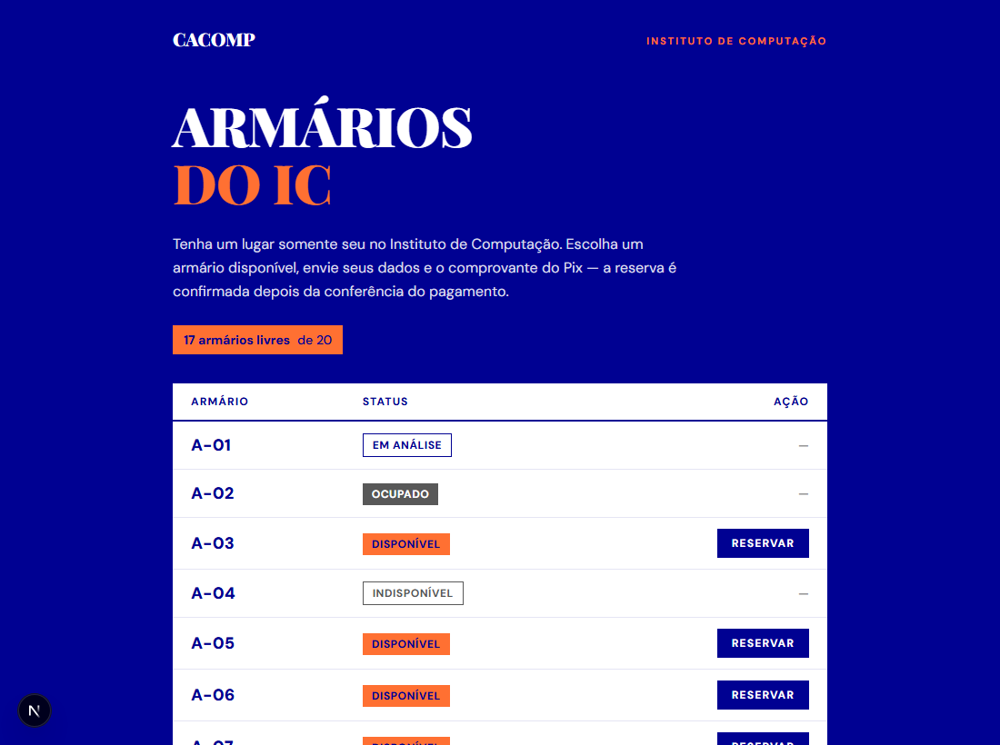
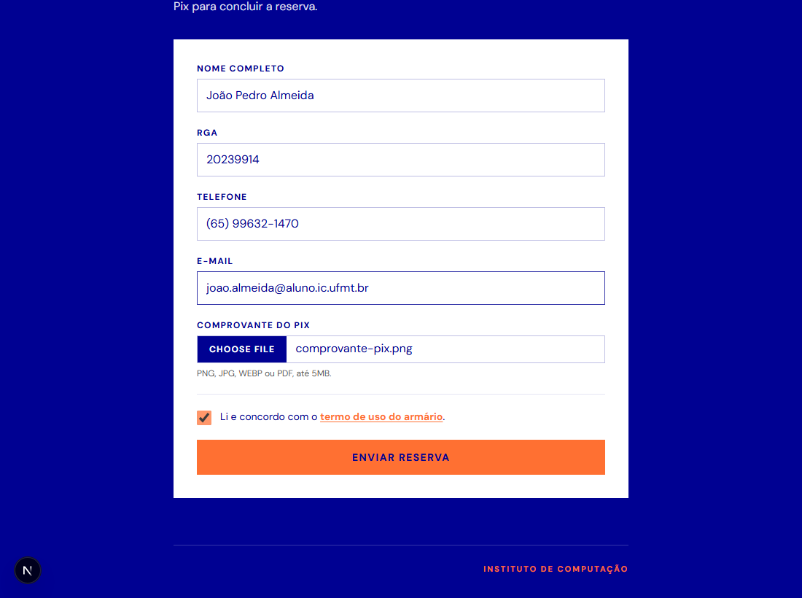
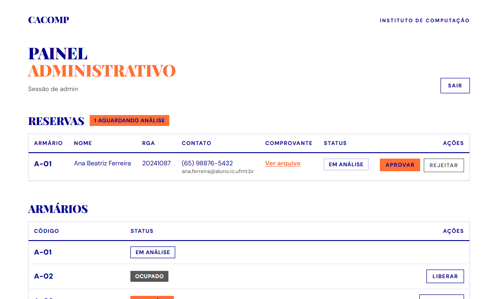

# Armários do IC — CACOMP

Sistema web para gerenciar a reserva dos armários do Instituto de
Computação da UFMT. O estudante escolhe um armário livre, preenche os
dados, aceita o termo de uso e anexa o comprovante do Pix. A diretoria do
CACOMP confere o comprovante e aprova ou rejeita — o status de cada
armário é atualizado automaticamente.

A interface segue o **Manual de Marca do CACOMP v1.0 (2026)**: paleta,
tipografia, tarja de identificação e tom de voz.



## Funcionalidades

- **Lista pública de armários** com status em tempo real: Disponível, Em
  análise, Ocupado ou Indisponível.
- **Formulário de reserva** com nome, RGA, telefone, e-mail, aceite
  obrigatório do termo de uso (com link) e anexo do comprovante de
  pagamento do Pix.
- **Painel administrativo** protegido por login, para conferir o
  comprovante e aprovar ou rejeitar cada reserva.
- **Gestão dos armários**: cadastrar novos, bloquear/desbloquear e liberar
  os que ficaram ocupados.
- **Reserva sem conflito**: duas pessoas clicando no mesmo armário ao mesmo
  tempo não geram reserva duplicada.

## Como funciona

1. A pessoa acessa a página inicial e clica em **Reservar** num armário
   disponível.
2. Preenche os dados, marca que leu o termo e anexa o comprovante
   (PNG, JPG, WEBP ou PDF, até 5 MB).
3. Ao enviar, o armário fica **Em análise** — reservado provisoriamente
   para ela.
4. A administração abre o comprovante no painel e **aprova** (o armário
   vira Ocupado) ou **rejeita** (o armário volta a ficar Disponível).

Os quatro estados de um armário:

| Status           | Significado                                              |
| ---------------- | -------------------------------------------------------- |
| **Disponível**   | Livre, aceita reserva                                     |
| **Em análise**   | Alguém reservou, aguardando conferência do comprovante    |
| **Ocupado**      | Reserva aprovada e em uso                                 |
| **Indisponível** | Bloqueado pela administração (manutenção, por exemplo)    |

| Formulário de reserva                  | Painel administrativo          |
| :------------------------------------: | :----------------------------: |
|  |  |

## Stack

- [Next.js](https://nextjs.org) 16 (App Router) + TypeScript
- [Tailwind CSS](https://tailwindcss.com) 4
- [Prisma](https://www.prisma.io) 6 + SQLite
- Sessão do admin em cookie `httpOnly` assinado (JWT via
  [jose](https://github.com/panva/jose)), senha com bcrypt
- Docker + Docker Compose

## Identidade visual

Os tokens da marca ficam em
[`src/app/globals.css`](src/app/globals.css) e os elementos reutilizáveis
(wordmark, tarja, etiquetas de status) em
[`src/components/marca.tsx`](src/components/marca.tsx).

| Token          | Valor     | Uso no manual                                     |
| -------------- | --------- | ------------------------------------------------- |
| `azul`         | `#000192` | Cor primária: fundo padrão e texto sobre claro    |
| `laranja`      | `#FF7032` | Cor de ação: destaques, tags, links e chamadas    |
| `branco`       | `#FFFFFF` | Texto sobre azul e fundo de leitura longa         |
| `cinza`        | `#585858` | Elementos secundários — nunca texto principal     |

O amarelo `#FFCC66` é cor estendida de colaborações e, conforme o manual,
não entra em peças oficiais — por isso não está declarado no projeto.

### Sobre a fonte de título

O manual especifica **Loubag** (Creative Media Lab) para títulos, que tem
licença comercial e não está incluída aqui. O projeto usa uma serifada de
peso equivalente como substituta — a mesma solução que o próprio manual
adota em suas páginas de pré-visualização.

Para aplicar a Loubag de verdade: coloque os arquivos em `src/app/fonts/`
e troque o bloco marcado em [`src/app/layout.tsx`](src/app/layout.tsx) por
`next/font/local`, mantendo a variável `--font-display`. Nenhum outro
arquivo precisa mudar.

### Sobre o símbolo

O manual proíbe recompor o símbolo (rede de pessoas + radar) a partir de
partes soltas e pede sempre o arquivo oficial — que não acompanha este
repositório. Por isso o cabeçalho usa o **wordmark "CACOMP"** isolado, uso
que o próprio manual autoriza. Para aplicar o símbolo, peça o SVG à
diretoria de comunicação e siga a orientação no comentário de
[`src/components/marca.tsx`](src/components/marca.tsx).

## Rodando com Docker

Pré-requisitos: Docker e Docker Compose.

```bash
git clone <url-do-repositorio>
cd armario-bloco
cp .env.example .env
```

Gere um segredo forte e coloque em `AUTH_SECRET` no `.env`:

```bash
node -e "console.log(require('crypto').randomBytes(32).toString('hex'))"
```

Defina também `ADMIN_PASSWORD`. Para já subir com armários de exemplo
(A-01 a A-20), use `SEED_EXAMPLE_LOCKERS="true"`.

```bash
docker compose up -d --build
```

Pronto: `http://localhost:3000` para a lista e
`http://localhost:3000/admin/login` para o painel.

O entrypoint aplica as migrations e garante o usuário admin a cada start,
de forma idempotente — subir de novo não duplica dados nem redefine a
senha (a menos que `ADMIN_FORCE_PASSWORD_RESET=true`).

### Persistência

Dois volumes nomeados guardam o que não pode se perder ao atualizar a
imagem:

| Volume            | Caminho no container | Conteúdo              |
| ----------------- | -------------------- | --------------------- |
| `armario-data`    | `/app/data`          | Banco SQLite          |
| `armario-uploads` | `/app/uploads`       | Comprovantes enviados |

Backup:

```bash
docker run --rm -v armario-bloco_armario-data:/data \
  -v "$PWD:/backup" busybox tar czf /backup/armario-data.tar.gz -C /data .
docker run --rm -v armario-bloco_armario-uploads:/uploads \
  -v "$PWD:/backup" busybox tar czf /backup/armario-uploads.tar.gz -C /uploads .
```

> O nome do volume recebe o prefixo do diretório do projeto. Confirme os
> nomes reais com `docker volume ls`.

### Comandos úteis

```bash
docker compose logs -f app     # acompanhar logs
docker compose restart app     # reiniciar
docker compose down            # parar (volumes preservados)
docker compose up -d --build   # aplicar mudanças de código
```

> `docker compose down -v` apaga os volumes — e com eles o banco e todos os
> comprovantes. Use apenas para zerar o sistema de propósito.

## Rodando localmente (desenvolvimento)

Pré-requisito: Node.js 20+.

```bash
cp .env.example .env    # ajuste AUTH_SECRET e ADMIN_PASSWORD
npm install
npm run db:migrate      # cria o banco e aplica as migrations
npm run db:seed         # cria o usuário admin (e os armários, se habilitado)
npm run dev
```

### Scripts

| Comando              | O que faz                                          |
| -------------------- | -------------------------------------------------- |
| `npm run dev`        | Servidor de desenvolvimento                        |
| `npm run build`      | Build de produção                                  |
| `npm run lint`       | ESLint                                             |
| `npm run db:migrate` | Cria/atualiza o banco local (`prisma migrate dev`) |
| `npm run db:deploy`  | Aplica migrations existentes (produção)            |
| `npm run db:seed`    | Garante o admin e os armários de exemplo           |
| `npm run db:studio`  | Abre o Prisma Studio para inspecionar o banco      |

## Variáveis de ambiente

| Variável                     | Obrigatória | Descrição                                               |
| ---------------------------- | ----------- | ------------------------------------------------------- |
| `AUTH_SECRET`                | sim         | Segredo que assina o cookie de sessão do admin          |
| `ADMIN_USERNAME`             | sim         | Usuário do primeiro admin (padrão `admin`)              |
| `ADMIN_PASSWORD`             | sim         | Senha usada ao criar o admin                            |
| `ADMIN_FORCE_PASSWORD_RESET` | não         | `true` redefine a senha do admin no próximo start       |
| `SEED_EXAMPLE_LOCKERS`       | não         | `true` cria armários de exemplo se o banco estiver vazio |
| `SEED_LOCKER_COUNT`          | não         | Quantos armários de exemplo criar (padrão `20`)         |
| `DATABASE_URL`               | não         | Já definida na imagem como `file:/app/data/app.db`      |
| `APP_PORT`                   | não         | Porta publicada no host pelo compose (padrão `3000`)    |

## Estrutura

```
prisma/
  schema.prisma          modelos: Locker, Reservation, AdminUser
  migrations/            histórico do banco
scripts/
  bootstrap.mjs          garante admin + armários (idempotente)
src/
  app/
    page.tsx             lista pública de armários
    armario/[id]/        formulário de reserva e tela de sucesso
    termos/              termo de uso
    admin/               login e painel administrativo
    api/admin/proof/     download do comprovante (exige sessão)
  components/
    marca.tsx            wordmark, tarja e etiquetas de status
  lib/
    actions/             server actions (reserva e administração)
    auth.ts              sessão do admin
    uploads.ts           gravação e leitura dos comprovantes
    validation.ts        regras de validação (zod)
Dockerfile
docker-compose.yml
docker-entrypoint.sh     migrations + bootstrap + start
```

## Personalizando

**Termo de uso** — o texto em
[`src/app/termos/page.tsx`](src/app/termos/page.tsx) é um modelo inicial.
Revise com a diretoria do CACOMP antes de divulgar o sistema.

**Armários** — cadastre os reais pelo painel administrativo, ou gere um
conjunto inicial com `SEED_EXAMPLE_LOCKERS` e `SEED_LOCKER_COUNT`.

**Contato** — o e-mail e o @ do CACOMP aparecem na tela de confirmação
([`src/app/armario/[id]/sucesso/page.tsx`](src/app/armario/%5Bid%5D/sucesso/page.tsx))
e no rodapé do termo de uso.

## Segurança

- Os comprovantes ficam em `uploads/`, **fora** de `public/`. Não são
  servidos estaticamente: só saem pela rota `/api/admin/proof/[id]`, que
  exige sessão de administrador.
- As senhas são guardadas com bcrypt; a sessão vai num cookie `httpOnly`
  com validade de 8 horas.
- **Use HTTPS em produção.** O cookie de sessão usa a flag `secure` quando
  `NODE_ENV=production`, então fora de `localhost` o login não funciona em
  HTTP puro. Coloque um proxy reverso na frente (Nginx, Caddy ou Traefik).
- O `.env` não vai para o repositório. Troque `ADMIN_PASSWORD` e
  `AUTH_SECRET` antes de expor o sistema.

## Notas de produção

O SQLite exige **um único container** com volume persistente — não escale o
serviço para várias réplicas. Se precisar disso um dia, troque o
`datasource` em `prisma/schema.prisma` para PostgreSQL e mova os
comprovantes para um storage externo (S3 ou similar).
